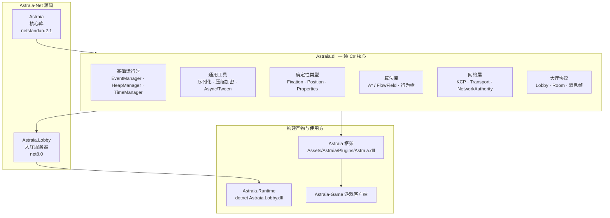

# Astraia-Net

纯 C# 的 Astraia 核心运行时与大厅服务器。不依赖 Unity，客户端、服务器与工具链复用同一套核心代码。

## 相关链接

- **博客**：[云谷千羽的博客](https://1176892094.github.io/) —— Astraia 与 Astraia-Net 的工程笔记、模块拆解与网络同步实践。

## 架构图



## 目录

| 目录 | 说明 |
|---|---|
| `Astraia/` | 核心库源码（netstandard2.1） |
| `Astraia.Lobby/` | 大厅服务器源码（net8.0） |
| `Astraia.Runtime/` | 服务器运行目录（构建输出 + 配置 + 启动脚本） |

## 核心功能

- **基础运行时**：事件系统、对象池、时间与异步、Tween。
- **通用工具**：二进制序列化、压缩、Xor 加密、扩展读写。
- **确定性类型**：定点数、坐标与属性集合。
- **算法库**：A* / FlowField 寻路、行为树。
- **网络层**：KCP 传输、Transport / NetworkAuthority、网络消息与 RPC 特性。
- **大厅协议**：房间数据、房间模式与消息帧定义。
- **大厅服务器**：房间列表、创建/加入/离开房间、房主踢人、主机与成员消息中继。

## 构建与运行

```bash
dotnet build Astraia.sln -c Release
cd Astraia.Runtime
dotnet Astraia.Lobby.dll
```

构建核心库后，`Astraia.dll` 会自动复制到 Astraia（Unity 框架）的 Plugins 目录，供游戏客户端复用。
